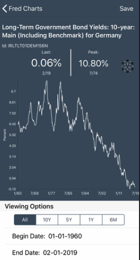
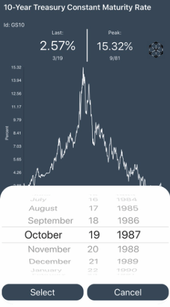
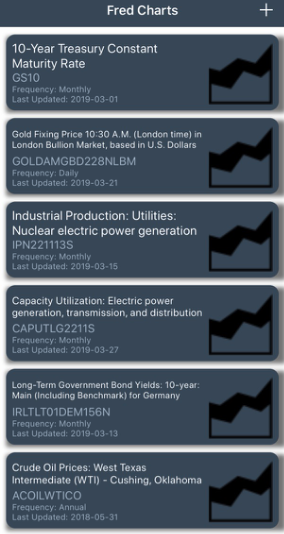
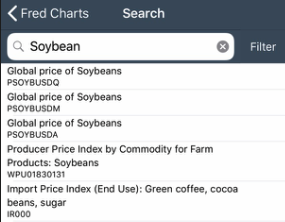

Fed Charts
====

FedCharts is an iOS app that can search, graph, and save data from St. Louis Federal Reserve Bank's [FRED API web
service](https://api.stlouisfed.org/docs/fred/).

For more information on the FRED API Documentation:
[http://api.stlouisfed.org/docs/fred/](https://api.stlouisfed.org/docs/fred/)

## Features

- [1] Search through the FRED API data set
- [2] View data in beautifully drawn charts
- [3] Adjust charts by specific date and time period and press to get details about data points
- [4] Save your favorite charts for later review
- [5] Charts automatically update the next time you run the app (assuming there's more data for the particular chart you're interested in)
